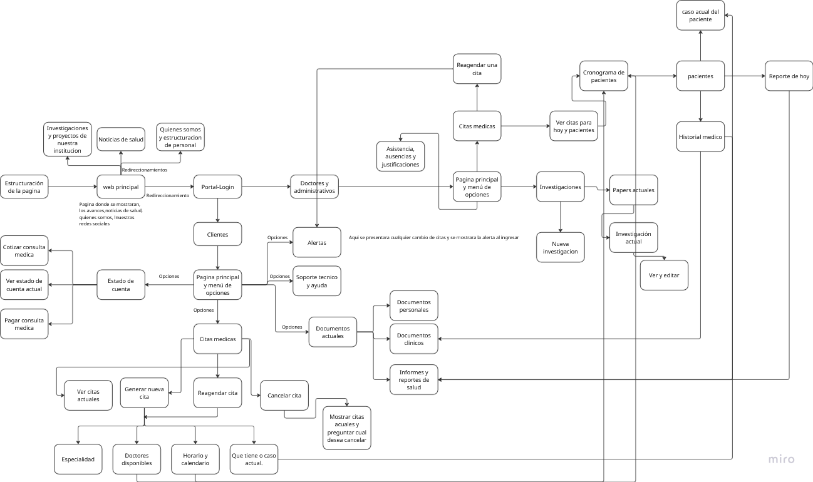

### Phase 1: Foundation

- **Database Design:** Based on the flowchart, design your database schema. You'll likely need tables for:
  - ~~`Users` (with roles: Patient, Doctor, Admin)~~
  - ~~`Patients` (linking to Users, storing demographic info)~~
  - ~~`Doctors` (linking to Users, storing specialty, availability)~~
  - `Appointments` (linking Patients, Doctors, storing date/time, status, reason)
  - `MedicalRecords` (linking to Patients, storing history, current cases, reports)
  - `ResearchProjects` (storing details, status, associated reports)
  - `Documents` (storing personal/clinical docs, linked to users)
  - `Payments` or `AccountStatements` (linking to Patients, storing consultation costs, payment status)
  - `Alerts` (storing messages, recipients, status)
  - Potentially tables for `Specialties`, `Schedules`, `Attendance`, etc.

### Phase 2: Core Functionality - Authentication and User Portals

- **Implement Authentication (`Portal Login`):**
  - ~~Create login functionality.~~
  - Implement user registration if needed (though the chart doesn't explicitly show it, it might be implied or handled administratively).
  - Implement role-based access control (RBAC) to differentiate between Patients (`Clientes`) and Doctors/Administrators (`Doctores y Administrativos`).
- **Develop the Main Website Structure (`Estructuración de la página`, `Web principal`):**
  - Create the basic layout/template for the site.
  - Build the public-facing pages:
    - Homepage (`Web principal`)
    - About Us / Staff Structure (`Quiénes somos y estructuración de personal`)
    - Health Mission (`Misión de salud`)
    - Institutional Research/Projects Overview (`Investigaciones y proyectos de nuestra institucion`)

### Phase 3: Patient (`Clientes`) Portal Development

- **Patient Dashboard (`Página principal y menú de opciones` - Client):** Create the main landing page for logged-in patients, linking to different sections.
- **Appointment Management (`Citas médicas` - Client side):**
  - `Generar nueva cita`: Allow patients to request appointments based on `Especialidad`, `Doctores disponibles`, and `Horario y calendario`. Capture `Qué tiene o caso actual`.
  - `Reagendar una cita`: Allow patients to reschedule existing appointments.
  - `Cancelar cita`: Allow patients to cancel appointments (potentially showing current ones and asking for confirmation: `Mostrar citas actuales y preguntar si desea cancelar`).
  - View upcoming appointments.
- **Account Status & Payments (`Estado de cuenta`):**
  - `Ver estado de cuenta actual`: Display the patient's account balance/statement.
  - `Costear consulta médica`: Show costs associated with consultations (this might be informational or part of the billing).
  - `Pagar consulta médica`: Integrate a payment gateway to allow online payments.
- **Access Documents/Info:**
  - Allow patients to view their `Documentos personales` and relevant `Documentos clínicos`.
  - Provide access to `Soporte técnico y ayuda`.

### Phase 4: Doctor/Administrator (`Doctores y Administrativos`) Portal Development

- **Doctor/Admin Dashboard (`Página principal y menú de opciones` - Doc/Admin):** Create the main landing page for logged-in staff.
- **Patient Management (`Pacientes`):**
  - View a list of patients.
  - Access individual `Historial médico` (Medical History).
  - View/Edit `Caso actual del paciente` (Patient's Current Case).
- **Scheduling & Appointment Management (`Cronograma de pacientes`, `Citas médicas` - Doc/Admin side):**
  - View patient schedules (`Cronograma de pacientes`).
  - `Ver citas para hoy y próximas`: View own upcoming appointments.
  - Handle appointment rescheduling (`Reagendar una cita`) - potentially confirming patient requests.
  - Manage own availability/calendar (implied by `Horario y calendario` on the client side).
- **Research Management (`Investigaciones`):**
  - View current research (`Investigación actual`).
  - Add `Nueva investigación`.
  - Manage `Reportes actuales` related to research.
  - View/Edit functionality (`Ver y editar`).
- **Reporting & Documentation (`Reporte de hoy`, `Informes y reportes de salud`):**
  - Generate daily reports (`Reporte de hoy`).
  - Generate other health summaries and reports.
  - Manage `Documentos clínicos` and `Documentos personales` (likely upload/associate for patients).
- **Administrative Functions:**
  - Manage `Asistencia, ausencias y justificaciones` (Attendance, Absences, Justifications) - likely for staff.
  - Handle `Alertas` (generating system or administrative alerts).
  - Access `Soporte técnico y ayuda`.

### Phase 5: Integration, Testing, and Deployment

- **Implement Shared Logic:** Ensure features used by both sides (like appointment viewing/scheduling logic, alerts, document access) are consistent and correctly linked.
- **API Development (if using separate Front-end/Back-end):** If you separated the front-end and back-end, ensure all API endpoints are built and functioning correctly.
- **Frontend/UI Implementation:** Build the user interfaces for all the screens and components described in the flowchart, ensuring a good user experience (UX).
- **Testing:**
  - **Unit Tests:** Test individual functions and components.
  - **Integration Tests:** Test the interaction between different parts of the application (e.g., does scheduling an appointment correctly update the doctor's calendar and the patient's view?).
  - **User Acceptance Testing (UAT):** Have potential users test the application to ensure it meets requirements and is easy to use.
- **Deployment:** Choose a hosting provider (cloud like AWS, Azure, Google Cloud, or traditional hosting) and deploy the application. Configure domain names, SSL certificates, etc.
- **Maintenance and Updates:** Plan for ongoing bug fixes, security updates, performance monitoring, and potential future feature enhancements.
